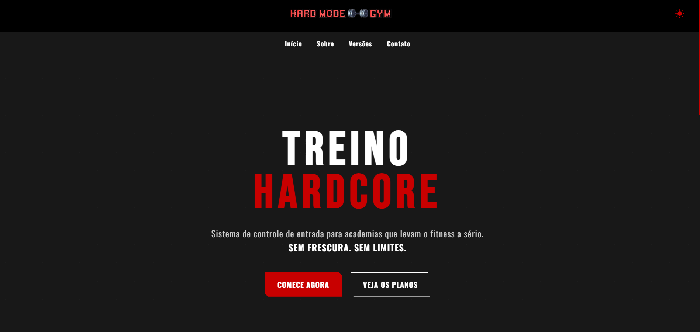

# HARD MODE GYM - Landing Page


<p align="center">
  
</p>

> Landing page do sistema de controle de acesso para academias "Hard Mode Gym". Um projeto que une a paixão por tecnologia e musculação, com foco em uma identidade visual forte, direta e sem frescuras.

<br>

## 📋 Tabela de Conteúdos

- [HARD MODE GYM - Landing Page](#hard-mode-gym---landing-page)
  - [📋 Tabela de Conteúdos](#-tabela-de-conteúdos)
  - [📖 Sobre o Projeto](#-sobre-o-projeto)
  - [✨ Funcionalidades](#-funcionalidades)
  - [🛠️ Tecnologias Utilizadas](#️-tecnologias-utilizadas)
  - [🚀 Como Executar](#-como-executar)

<br>

## 📖 Sobre o Projeto

O **Hard Mode Gym** nasceu como um Trabalho de Conclusão de Curso (TCC) com o objetivo de criar não apenas um sistema funcional de controle de acesso para academias, mas também uma marca com uma identidade forte. Esta landing page serve como a vitrine do projeto, apresentando seus conceitos, funcionalidades e a filosofia "sem desculpas, só resultados".

O site foi construído do zero, com foco em uma experiência de usuário fluida, design responsivo e interações que refletem a energia do projeto.

<br>

## ✨ Funcionalidades

- **🎨 Design Responsivo:** Totalmente funcional em desktops, tablets e celulares.
- **🌗 Tema Claro e Escuro:** Alternância de tema para preferência do usuário.
- **🔥 Modo "HARD MODE":** Um tema alternativo "brutal" que muda textos e a identidade visual do site.
- **📄 Navegação SPA:** Transição suave entre as seções (Início, Sobre, Versões, Contato) sem recarregar a página.
- **🃏 Cards Interativos:** Efeito de "flip" nos cards da seção "Versões" para exibir detalhes.
- **🖼️ Modal de Imagens:** Visualização em tela cheia das imagens dos recursos do sistema.
- **✉️ Formulário de Contato:** Integração com **EmailJS** para envio de e-mails diretamente do site.
- **🌟 Animações Sutis:** Efeitos de fade-in e scroll para uma experiência mais dinâmica.

<br>

## 🛠️ Tecnologias Utilizadas

Este projeto foi construído utilizando as seguintes tecnologias:

- **HTML5:** Estruturação semântica do conteúdo.
- **CSS3:** Estilização, responsividade, variáveis CSS para temas, Flexbox e Grid Layout.
- **JavaScript (Vanilla):** Manipulação do DOM, interatividade, troca de temas e lógica de navegação.
- **EmailJS:** Serviço para envio de e-mails pelo lado do cliente.

<br>

## 🚀 Como Executar

Para executar o projeto localmente e com todas as funcionalidades, siga estes passos:

1. Clone o repositório:
   ```bash
   git clone [https://github.com/SEU-USUARIO/hardmode-gym-landing-page.git](https://github.com/SEU-USUARIO/hardmode-gym-landing-page.git)
   Navegue até a pasta do projeto:
   ```

Bash

cd hardmode-gym-landing-page
⚙️ Configuração do Ambiente
Por motivos de segurança, as chaves da API do EmailJS não estão incluídas neste repositório. Para habilitar a funcionalidade de envio de e-mail, você precisará criar sua própria configuração:

Na raiz do projeto, localize o arquivo config.example.js.

Crie uma cópia deste arquivo e renomeie-a para config.js.

Abra o config.js e insira suas chaves pessoais do EmailJS nos locais indicados. O arquivo config.js é intencionalmente ignorado pelo Git (.gitignore) para proteger suas chaves.

Após configurar, abra o arquivo index.html no seu navegador de preferência.

Dica: Para uma melhor experiência de desenvolvimento, recomendo usar a extensão "Live Server" no Visual Studio Code, que atualiza a página automaticamente a cada alteração.

💪 Equipe
Este projeto foi forjado pela seguinte equipe:

Membro Função
Ricardo Lourenção - Desenvolvedor Back-end (C#)
Mateus Gerazo - Desenvolvedor Front-end (Web)
João Pedro Costa - Analista de Operações
Murilo Fadini - Design de Marca & Visual

📜 Licença
Este projeto está sob a licença MIT. Veja o arquivo LICENSE para mais detalhes.
